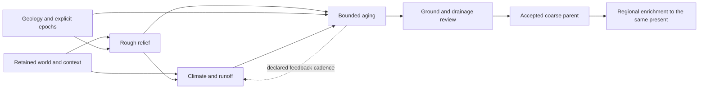

# Ordered terrain implementation plan

Updated 2026-09-28. **Active milestone: M1, next to implement.** This update
reorders work; it does not implement context consumption or application aging.
Last implementation: shared ridge crests, commit `78c9db5`.

Build one testable path from an imported world through context, rough terrain,
runoff and geological aging before further isolated landform refinement. Keep
one active milestone and at most one experiment needed to choose its next step.
This file owns execution order; WC/LE/R and A-F IDs identify supporting work,
not competing queues. [TODO](../../TODO.md) retains the complete feature backlog.

## What works now

- World import, geographic context, geology recipes and bathymetry have their own
  usable workflows. Context and bathymetry are not consumed by land generation.
- World-to-terrain transfers coastlines, continuous physical land, scale and
  optional authored landform controls. Continent borders are not coasts.
- The local generator/editor/build system works, including profiles and saved-parent
  experiments. Aging runs only in an isolated research reference; stored geological
  ages do not drive application generation. [Current status](../research/status.md)
  owns the detailed evidence and limitations.

## Next implementation order

| Order / state | Deliverable and required connections | Completion evidence | Existing owners |
|---|---|---|---|
| **M1 — NEXT** | **Context-bound rough terrain.** Match world, geographic context and optional geology/bathymetry inputs; project one supported connected landmass into a bounded physical domain. Generate broad relief with explicit controls and retain sampled context/support for the following stages. | A saved, reopenable rough build identifies consumed versus retained fields; coastal context reaches a numerical terrain operation, input mismatch is rejected, and continent-label changes leave physical land unchanged. | WC1/WC2, R01/R02/R49 |
| **M2 — queued after M1** | **Initial climate and runoff.** Connect world latitude, explicit planetary/wind assumptions, selected oceans and rough relief to a small moisture/temperature/runoff model. Preserve water-source identity and budgets. | Fixed-relief coastal/interior and windward/leeward controls respond for declared reasons; water accounting and units pass. Geographic exposure alone is never labelled rainfall. | WC3, R07/R10/R33/R49 |
| **M3 — queued after M2** | **Application aging.** Feed M1 relief, M2 runoff and explicit uplift/resistance/epoch inputs into the existing evolution reference through a narrow adapter. Publish evolved ground and derive drainage from that same result. | One end-to-end experimental build with aging off/on and changed history; bounded execution, immutable inputs, reproducible state and visible quality failures. No duplicate automatic carving or second application of the full history. | LE1/LE3/basic LE5, WC2/WC3, R11/R14/R48 |
| **M4 — queued after M3** | **Coupled, inspectable workflow.** Recompute climate/runoff against changing relief at a declared cadence; bound feedback. Connect stage previews, comparison, history controls, cancellation, stale results, world placement and exports. | A user can run, inspect, change an input and regenerate the complete path. Restarts resume a declared state or replay from initial conditions; nonconvergence is visible. No settings without a consuming backend. | WC3/WC4 candidate, LE5, R27/R32/R49 |
| **M5 — queued after M4** | **Quality, wider world and accepted parent.** Fix the dominant integrated failures, extend unsupported wide/seam/polar domains with shared boundaries, and compare the coupled candidate with the local baseline before default adoption. Freeze an accepted coarse world parent. | Matched terrain/river/history gallery, authoring and physical-budget controls, cross-label flow, projection/overlap checks and packaged dependency audit pass. Record an adoption ADR; remove superseded generation paths. | LE2/LE3, WC2-WC4, A/B/C, R25/R40-R43/R48 |
| **M6 — after an accepted parent** | **Regional enrichment and zoom.** Refine the same world present using parent terrain/history and boundary inflows. Add fine hydrology, then bounded viewport jobs and water visibility by physical resolution and display scale. | Adjacent/overlapping requests agree, coarse-scale and inherited-flow controls pass, revisits do not age terrain again. Small rivers appear only with adequate local generation; large water remains visible from afar. | LE6, WC5, D, R15/R34 |
| **M7 — deferred extensions** | **Water/materials and selected landforms.** Add discharge-based river size, lake storage, sediment/deposition and chosen canyon, groundwater, glacial, volcanic or dune processes when the integrated result exposes a need. | Each selected mechanism has its own reference/control, conservation ledger and visible improvement; implement one at a time. | LE4, E, R16/R18/R19/R24/R33 |
| **M8 — deferred extensions** | **Ecology and stronger planetary models.** Derive biomes/wetlands from accepted continuous climate, water and substrate fields; compare advanced ocean/plate/climate tools only for a measured gap. | Traceable classifications, uncertainty and distinct biome/landform/land-use semantics; external models justify their cost and dependencies. | WC6, F, R20-R24/R49 |

M1-M4 form the first integrated experimental milestone; M5 accepts it for normal
use. M7/M8 are a later selection order, not a requirement to implement every
process: basic ecology needs accepted climate/water, not all sediment or karst work.
Each milestone includes the minimum CLI/editor/export connection needed to test it.

## Planned data flow

This is the target, not the current code path. Bathymetry supplies explicit ocean
hypotheses only where a model consumes them; ocean depth does not automatically
set mountains or climate. Continental age, rejuvenation and simulation duration
remain independent. [World connections](world-context.md#first-integrated-application-slice)
and [history integration](landscape-evolution.md#experimental-application-integration)
own stage inputs, units, feedback and boundary details.

## Concrete next batch: M1

1. Bind matching source/context/recipe identities and support flags in one current
   generation specification. Reuse existing adapters and validation; do not build
   a generic simulation framework or legacy migration layer.
2. Transfer context to one supported metric connected-land domain, with explicit
   sampling, coast-distance error and unresolved-cell policy. Preserve world
   coordinates, islands, holes and true straits. Reject unsupported projection
   extents rather than shrinking the world or cutting at a continent label.
3. Reuse geological landform controls for initial macro relief. Connect valid
   geographic shoreline information to physical coastal support under explicit
   settings, without converting water exposure or age into arbitrary heights.
   Carry ocean/directional data to M2 with their actual semantics.
4. Publish initial ground plus the context consumed/retained/unsupported record,
   usable through the existing application, CLI and preview. No hidden aging.
5. Compare a small public context-enabled/disabled pair with identical source,
   scale, seed and authored controls; test mismatches, supported coastal response,
   context queries and ownership-border independence. A copied context bundle
   with no numerical consumer does not complete M1.

Choose a supported public domain first. Private maps are later manual checks,
not required fixtures. Link evidence before moving the active milestone to M2.

## Integration checks and adoption checks

| Always required, including experiments | Required before default adoption or stronger claims |
|---|---|
| Preserved source geography and declared authored-input roles; explicit units, coordinates, time, dependencies and deterministic seeds. | Broader seed/rotation/scale and real-domain terrain quality; accepted final-ground/channel correspondence and supported authoring coverage. |
| Finite numeric state, valid masks, declared water/material corrections, step/output budgets, cancellation and honest incomplete results. | Calibrated physical assumptions, conservation/constraint evidence for advertised capabilities, boundary/parent consistency and distribution/license review. |
| Supported inputs enforced; failures distinguished from unsupported cases and unaccepted visual quality; experimental status retained on save/reopen. | A reviewed adoption decision and the same controls on the integrated application, not only a standalone benchmark. |

A visual defect may remain visible in an experimental candidate. Corrupt state,
silently altered hard constraints or an unbounded solve may not. Do not weaken
existing tolerances to pass a candidate; scope its supported inputs and claims.
Use the [quality reference](terrain-quality.md) and failed-method evidence to fix
what the integrated comparison identifies, instead of finishing every isolated
river/ridge experiment first. Surface-authority changes still require an ADR and
all affected consumers; current Float32 DEM authority remains unchanged.

## Deliberately deferred

Further ridge handles/spurs/cross-section polish, exhaustive bank interpolation,
new terrain presets, groundwater/karst, GPU work, Rust migration and speculative
performance tuning do not lead M1-M4. Reopen one only for a demonstrated blocker,
recorded with the affected milestone and a bounded test. Python, modular files,
generation-only editing and no legacy-save support remain the working policy.
Post-generation sculpting stays only a possible separate future tool/module.

## Keep this plan current

Before selecting work, read this file and the [decision catalog](../research/decision-catalog.md).
For every substantive implementation or experiment, update the following in the
same validated commit:

1. This page's date, active milestone and last implementation; record whether the
   result is implemented, experimental, accepted, blocked, deferred or rejected.
   Move a milestone only when its completion evidence is linked.
2. [TODO](../../TODO.md)'s affected existing items and [current status](../research/status.md).
   WC/LE plans receive changed contracts/dependencies, not a copied competing queue.
3. The catalog's affected decision, reason, evidence and revisit trigger. For a
   failed or limited method, update the stable T entry in the
   [method register](../research/terrain-method-decisions.md); preserve failed controls.
4. A dated report for material new measurements, with source/runtime identity,
   controls, units, limits, failures and outcome. Append a superseding ADR when an
   accepted architecture changes; keep old reports as historical evidence.
5. Links and [file inventory](../FILE_INDEX.md) if files change; search active plans
   for contradictory next-step wording. A documentation-only batch runs document
   checks; implementation retains the repository's applicable runtime gates.

Keep one owner per fact: this plan = order; status = capability; TODO = scope;
catalog = decision/conclusion; method register = failed attempts; dated reports =
evidence; [dependencies](../DEPENDENCIES.md) = adopted packages/licenses. Unknown
or untested is not rejected. Revisit an old method only with a changed requirement,
new evidence or a specific unresolved gap. Consult before tests expected to exceed
roughly two minutes or with uncertain long duration; give purpose, estimate and stop limit.
