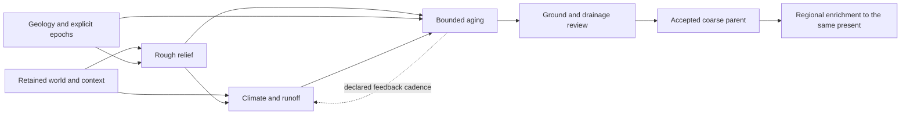

# Ordered terrain implementation plan

Updated 2026-09-28. **Active milestone: M2.** M1 context-bound rough terrain is
implemented as an experimental application slice; climate, runoff and aging remain
unsupported. Final repository validation for this batch is recorded in the
[implementation report](../research/2026-09-28-context-bound-rough-terrain.md).

Build one testable path from an imported world through context, rough terrain,
runoff and geological aging before further isolated landform refinement. Keep
one active milestone and at most one experiment needed to choose its next step.
This file owns execution order; WC/LE/R and A-F IDs identify supporting work,
not competing queues. [TODO](../../TODO.md) retains the complete feature backlog.

## What works now

- World import, geographic context, geology recipes and bathymetry have their own
  usable workflows. M1 binds matching geographic context into rough terrain;
  bathymetry remains a separate, unconsumed hypothesis product for M2.
- World-to-terrain transfers coastlines, continuous physical land, scale and
  optional authored landform controls. Continent borders are not coasts.
- The local generator/editor/build system works, including profiles and saved-parent
  experiments. Aging runs only in an isolated research reference; stored geological
  ages do not drive application generation. [Current status](../research/status.md)
  owns the detailed evidence and limitations.

## Next implementation order

| Order / state | Deliverable and required connections | Completion evidence | Existing owners |
|---|---|---|---|
| **M1 — implemented, experimental** | **Context-bound rough terrain.** Match world and geographic context, project one supported connected landmass into a bounded metric domain, and retain immutable sampled support for every terrain consumer. Geology remains optional authored macro-relief guidance; bathymetry is explicitly unconsumed. | Saved projects, snapshots and builds identify consumed, retained and unsupported fields. Exact source/projection/geology mismatches fail; coastal context changes rough relief while source masks and hard constraints remain authoritative; ownership splits do not change sampled ground. | WC1/WC2, R01/R02/R49; [evidence](../research/2026-09-28-context-bound-rough-terrain.md) |
| **M2 — ACTIVE** | **Initial climate and runoff.** Connect world latitude, explicit planetary/wind assumptions, selected oceans and rough relief to a small moisture/temperature/runoff model. Preserve water-source identity and budgets. | Fixed-relief coastal/interior and windward/leeward controls respond for declared reasons; water accounting and units pass. Geographic exposure alone is never labelled rainfall. | WC3, R07/R10/R33/R49 |
| **M3 — queued after M2** | **Application aging.** Feed M1 relief, M2 runoff and explicit uplift/resistance/epoch inputs into the existing evolution reference through a narrow adapter. Publish evolved ground and derive drainage from that same result. | One end-to-end experimental build with aging off/on and changed history; bounded execution, immutable inputs, reproducible state and visible quality failures. No duplicate automatic carving or second application of the full history. | LE1/LE3/basic LE5, WC2/WC3, R11/R14/R48 |
| **M4 — queued after M3** | **Coupled, inspectable workflow.** Recompute climate/runoff against changing relief at a declared cadence; bound feedback. Connect stage previews, comparison, history controls, cancellation, stale results, world placement and exports. | A user can run, inspect, change an input and regenerate the complete path. Restarts resume a declared state or replay from initial conditions; nonconvergence is visible. No settings without a consuming backend. | WC3/WC4 candidate, LE5, R27/R32/R49 |
| **M5 — queued after M4** | **Quality, wider world and accepted parent.** Fix the dominant integrated failures, extend unsupported wide/seam/polar domains with shared boundaries, and compare the coupled candidate with the local baseline before default adoption. Freeze an accepted coarse world parent. | Matched terrain/river/history gallery, authoring and physical-budget controls, cross-label flow, projection/overlap checks and packaged dependency audit pass. Record an adoption ADR; remove superseded generation paths. | LE2/LE3, WC2-WC4, A/B/C, R25/R40-R43/R48 |
| **M6 — after an accepted parent** | **Regional enrichment and zoom.** Refine the same world present using parent terrain/history and boundary inflows. Add fine hydrology, then bounded viewport jobs and water visibility by physical resolution and display scale. | Adjacent/overlapping requests agree, coarse-scale and inherited-flow controls pass, revisits do not age terrain again. Small rivers appear only with adequate local generation; large water remains visible from afar. | LE6, WC5, D, R15/R34 |
| **M7 — deferred extensions** | **Water/materials and selected landforms.** Add discharge-based river size, lake storage, sediment/deposition and chosen canyon, groundwater, glacial, volcanic or dune processes when the integrated result exposes a need. | Each selected mechanism has its own reference/control, conservation ledger and visible improvement; implement one at a time. | LE4, E, R16/R18/R19/R24/R33 |
| **M8 — deferred extensions** | **Ecology and stronger planetary models.** Derive biomes/wetlands from accepted continuous climate, water and substrate fields; compare advanced ocean/plate/climate tools only for a measured gap. | Traceable classifications, uncertainty and distinct biome/landform/land-use semantics; external models justify their cost and dependencies. | WC6, F, R20-R24/R49 |

M1-M4 form the first integrated experimental milestone; M5 accepts it for normal
use. M7/M8 are a later selection order, not a requirement to implement every
process: basic ecology needs accepted climate/water, not all sediment or karst work.
Each milestone includes the minimum CLI/editor/export connection needed to test it.

## Planned data flow

The retained-context to rough-relief edge and explicit geology landform controls
are implemented; geology epochs and the remaining arrows are the target path.
Bathymetry supplies explicit ocean hypotheses only
where a later model consumes them; ocean depth does not automatically set mountains
or climate. Continental age, rejuvenation and simulation duration remain independent.
[World connections](world-context.md#first-integrated-application-slice)
and [history integration](landscape-evolution.md#experimental-application-integration)
own stage inputs, units, feedback and boundary details.

## Completed M1 boundary

The World workspace passes its current generated or opened context into
**World → Terrain**; the CLI uses `world terrain --context`. Preparation verifies
the exact world, projection and optional geology recipe, then freezes at most
129 × 129 metric support samples into project v9. Continuous fractions and
exposure use bilinear interpolation; categorical IDs/flags use nearest support.
The coastal consumer uses the smaller of exact projected-vector distance and a
continuous conservative spherical upper bound. It never replaces the vector land
mask, invents water links or consumes bathymetry. Project/snapshot/build provenance
records numeric-context, producer-runtime and sampled-binding identities separately.

Supported M1 domains are bounded AEQD projections whose complete support stencil
has source latitude-cell centres. Polar domains reject explicitly. Selecting a
continent may include physically connected neighbours; M1 still rejects domains
beyond local projection/support limits and does not produce an accepted world
parent. Climate, runoff, aging, bathymetry coupling and water transport remain
marked unsupported. See [ADR-0084](../adr/0084-bind-geographic-context-to-rough-terrain.md)
and the [measured report](../research/2026-09-28-context-bound-rough-terrain.md).

## Concrete next batch: M2

1. Define a small inspectable temperature/moisture/runoff model with explicit
   planet, wind, season, units, validity and conservation assumptions.
2. Consume M1 latitude, retained water/source identity, directional diagnostics
   and rough relief without relabelling all-water exposure as rainfall or fetch.
3. Decide whether the separate bathymetry product has a real numerical consumer;
   if not, keep it retained and explicitly unconsumed.
4. Publish fixed-relief coastal/interior and windward/leeward controls, runoff
   budgets and provenance through the existing experimental workflow.

## Integration checks and adoption checks

| Always required, including experiments | Required before default adoption or stronger claims |
|---|---|
| Preserved source geography and declared authored-input roles; explicit units, coordinates, time, dependencies and deterministic seeds. | Broader seed/rotation/scale and real-domain terrain quality; accepted final-ground/channel correspondence and supported authoring coverage. |
| Finite numeric state, valid masks, declared water/material corrections, step/output budgets, cancellation and honest incomplete results. | Calibrated physical assumptions, conservation/constraint evidence for advertised capabilities, boundary/parent consistency and distribution/license review. |
| Supported inputs enforced; failures distinguished from unsupported cases and unaccepted visual quality; experimental status retained on save/reopen. | A reviewed adoption decision and the same controls on the integrated application, not only a standalone benchmark. |

A visual defect may remain visible in an experimental candidate. Corrupt state,
silently altered hard constraints or an unbounded solve may not. Do not weaken
existing tolerances to pass a candidate; scope its supported inputs and claims.
Use the [quality reference](terrain-quality.md) and failed-method evidence to fix
what the integrated comparison identifies, instead of finishing every isolated
river/ridge experiment first. Surface-authority changes still require an ADR and
all affected consumers; current Float32 DEM authority remains unchanged.

## Deliberately deferred

Further ridge handles/spurs/cross-section polish, exhaustive bank interpolation,
new terrain presets, groundwater/karst, GPU work, Rust migration and speculative
performance tuning do not lead M1-M4. Reopen one only for a demonstrated blocker,
recorded with the affected milestone and a bounded test. Python, modular files,
generation-only editing and no legacy-save support remain the working policy.
Post-generation sculpting stays only a possible separate future tool/module.

## Keep this plan current

Before selecting work, read this file and the [decision catalog](../research/decision-catalog.md).
For every substantive implementation or experiment, update the following in the
same validated commit:

1. This page's date, active milestone and last implementation; record whether the
   result is implemented, experimental, accepted, blocked, deferred or rejected.
   Move a milestone only when its completion evidence is linked.
2. [TODO](../../TODO.md)'s affected existing items and [current status](../research/status.md).
   WC/LE plans receive changed contracts/dependencies, not a copied competing queue.
3. The catalog's affected decision, reason, evidence and revisit trigger. For a
   failed or limited method, update the stable T entry in the
   [method register](../research/terrain-method-decisions.md); preserve failed controls.
4. A dated report for material new measurements, with source/runtime identity,
   controls, units, limits, failures and outcome. Append a superseding ADR when an
   accepted architecture changes; keep old reports as historical evidence.
5. Links and [file inventory](../FILE_INDEX.md) if files change; search active plans
   for contradictory next-step wording. A documentation-only batch runs document
   checks; implementation retains the repository's applicable runtime gates.

Keep one owner per fact: this plan = order; status = capability; TODO = scope;
catalog = decision/conclusion; method register = failed attempts; dated reports =
evidence; [dependencies](../DEPENDENCIES.md) = adopted packages/licenses. Unknown
or untested is not rejected. Revisit an old method only with a changed requirement,
new evidence or a specific unresolved gap. Consult before tests expected to exceed
roughly two minutes or with uncertain long duration; give purpose, estimate and stop limit.
