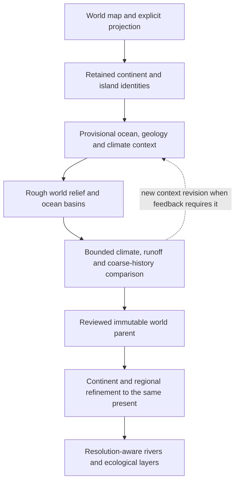

# World-context and staged terrain implementation plan

Updated 2026-09-27. **WC0 implemented; WC1 geography/reopening/edge/exposure, authored geology and bathymetry slices delivered; remaining WC1-WC6 work planned.** The
[World workspace](../terrain-worlds.md) imports retained SVG sources, validates
explicit spherical placement and ownership, and saves portable world projects.
World → Terrain now transfers a selected continent and connected land into a
usable local generation project with retained world/projection identity. This
standalone handoff is implemented; climate and continent-history coupling are not.
The [research review](../research/2026-09-24-world-context-enrichment.md) records
primary sources, existing solutions, licenses and the limits of the recommendation.
The [main strategy](README.md) owns execution order; [TODO R49](../../TODO.md)
owns this feature's backlog. Existing landscape evolution remains governed by
[LE0-LE6](landscape-evolution.md), rather than a second erosion engine here.
The [groundwater/canyon reassessment](../research/2026-09-25-groundwater-and-terrain-architecture.md)
adds conditional hydrogeology and layered-erosion experiments after the surface
construction decision. If accepted, provinces will need explicit hydraulic
conductivity, storage, aquifer base and soluble-rock hypotheses; existing province
age or erodibility does not determine those properties. Aquifer boundaries need
not follow surface divides or continent labels. Full groundwater and cave modeling
are not prerequisites for WC2 rough terrain, and no such fields are implemented
by the current geology recipe.

## Product outcome and sequence

Import one authored world, preserve its coastlines and continent identities,
construct shared geographic context, and use that context to generate varied,
related landscapes. The user can adjust instructions between builds and inspect
previous results as backgrounds. Generated ground is never edited in place.



The feedback arrow is bounded and creates candidate revisions. It is not an
unlimited simulation and must not repeatedly age an already completed landscape.
A preview can remain useful before all phases ship, but must identify which
products are provisional and which capabilities it actually contains.

The intended user sequence is:

1. **Import the world.** Confirm projection/frame, physical scale, continents,
   islands, holes and excluded map furniture in a source preview.
2. **Generate context.** Inspect ocean connections, geographic exposure and
   proposed geological provinces. Select planetary assumptions and histories;
   generated context remains a labelled hypothesis until selected for a build.
3. **Generate rough terrain.** Produce broad ranges, basins, lowlands and ocean
   relief. Re-evaluate seasonal climate/runoff against that relief and compare
   a bounded coarse evolution result before accepting the parent.
4. **Generate selected parts.** Choose a continent or a bounded region and its
   physical resolution. Reuse the same world, time, upstream context and history.
   Where geological replay is available, refine that history to the same present.
5. **Iterate through inputs.** Place new mountain, resistance, desert/aridity or
   history guidance over the read-only result and regenerate affected products.
   A new mountain belt can affect climate beyond its continent; show those effects.

High-resolution historical refinement is an intended capability, not a claim
about the present residual-detail command. Exported low-resolution previews,
physical process resolution and display zoom are separate settings.

## Delivered standalone terrain handoff

[ADR-0079](../adr/0079-project-world-land-into-terrain.md) and the
[workflow report](../research/2026-09-27-world-to-terrain-workflow.md) document the
first usable source-to-terrain path. It preserves islands, holes, physical
neighbours and planetary scale; uses a bounded metric projection; and opens an
ordinary terrain project through the existing editor's document guards.

This is an explicit early product slice, not completion of WC2 or WC4. Context,
bathymetry, geology and aging do not yet drive the generated ground. Wide
connected land needs regional domains with shared boundary conditions. Result
georeferencing/overlay and geological landform guidance are feature follow-ups;
none requires pretending the current river/history research passed its gates.

## What is authoritative

### Authored geography and coordinate contract

- Preserve source geometry and transforms, the full world projection frame,
  planetary radius and stable continent/island membership. Keep original source
  identity as provenance and an effective geometry snapshot for portable builds.
- Retain semantic groups before deriving any land union. A named continent is
  neither necessarily one connected component nor a tectonic plate. Connected
  land may cross continent labels; an island's owner cannot be guessed from its
  nearest mainland. Catchments and geology can cross these labels.
- Exclude legends, scale bars, labels and decorative fills by explicit import
  selection/mapping. Ambiguous groups, duplicate IDs, unusable fills and unassigned
  land require visible resolution. [ADR-0072](../adr/0072-bound-world-source-imperfections.md)
  permits reported, bounded preparation of derived coverage: tiny polar overflow,
  same-owner shared land and narrow foreign border overlaps. Original source,
  assignments and frame remain authoritative; larger foreign conflicts still fail.
  Source geometry repair remains a separate proposed input revision with a preview.
- The first input is SVG plus explicit world metadata and retained element/group
  mappings. Read group transforms, holes and selected paths. SVG self-crossings
  are interpreted through their fill rule, not rejected as invalid simple rings.
  Bounds/overlap adjustments are now consolidated in a selectable report and
  prepared coverage counts area once. WC1 must consume this prepared coverage and
  its preparation identity, not independently sum original overlapping fills.
  Raster segmentation,
  vector geospatial imports and native Affinity import are separate later options;
  do not imply that the current SVG importer reads `.af` documents.
- Do not normalize each continent to its own bounding box. Source-to-sphere and
  sphere-to-local-projection transforms must preserve placement through a common
  frame. The initial projection adapter can support explicitly declared spherical
  Plate Carree; reject unsupported projections rather than guess from image shape.
- A Plate Carree grid has unequal physical east-west spacing. Use geodesic
  distances, spherical cell areas, periodic longitude and a specified pole policy.
  Split/wrap antimeridian geometry without losing identity or duplicating area.
  A map that does not cover the full globe must declare its extent and missing
  context; padding unknown oceans is not a valid implicit default.
- Current local endpoint-node rasters stay distinct from proposed cell-centred
  climate grids. Define conservative transfer for extensive quantities and
  area-weighted transfer for averages; never treat node elevations as cell means.
- Custom-planet geography must not be labelled Earth EPSG:4326. Preserve a custom
  sphere/projection definition and explicit coordinate units in an eventual
  exchange adapter. GeoJSON's WGS 84 convention needs an explicit policy before
  that format is offered; schema or file-extension reuse cannot create a new CRS.

A campaign's existing map frame is authoritative input. Reusable source code and
public examples must not contain private campaign maps, names or fixed radii.
The coastline vector is invariant; a coarse raster's fractional coverage is an
approximation of that same geometry, not permission to redraw it.

### Planet, oceans and geological hypotheses

**One planet and present.** Planet radius, rotation, orbit/obliquity, incident
radiation, atmospheric assumptions, sea-level datum and time convention belong
to the world. An Earth-like preset is an explicit starting assumption. Gravity
must be declared before tools needing geopotential or pressure are used; an
ExoPlaSim adapter must convert height to its documented geopotential input.

**Several different ocean descriptors.** Keep these distinct:

| Descriptor | Role | First implementation boundary |
|---|---|---|
| Connected water and gateways | Permitted moisture/heat pathways and coastal setting | Derived from geometry with explicit subgrid strait/sill evidence |
| Named ocean regions | User-facing identity and optional parameter zones | Tags within connected water, not automatically separate oceans |
| Upwind water exposure and interior distance | Moisture-fetch and continentality diagnostics | Directional/geodesic context; not just nearest coast or total ocean area |
| Shelf/slope/abyssal depth | Bathymetric context and later circulation constraints | Constrained hypotheses, not uniquely recovered from the shoreline |
| Surface mixed-layer depth | Seasonal heat capacity | Independent effective depth, limited by local water-column depth where appropriate |
| Sea-surface temperature and heat transport | Atmospheric boundary forcing | Initially prescribed or reduced-model scenarios with uncertainty |

Start bathymetry from shelf widths, active/passive margin hypotheses, slope/basin
priors, optional ridge/trench guidance and a coast boundary. Plate-history-derived
seafloor age is a later alternative when the user supplies enough reconstruction
inputs. Ocean width alone determines neither age nor depth. Report unresolved
straits/islands at coarse resolution and retain a topology/gateway representation;
not every one-cell ocean gap is a real passage.

The separate bathymetry product stores negative ocean-floor elevations. That
does not relax the existing land DEM contract without an explicit R07 decision.
Use authoritative land/ocean connectivity, not the sign of elevation, to identify
the sea. Below-datum inland basins and lakes need their own supported semantics.
Moving shorelines, emergent islands, sea-level history and free plate advection
are outside the first fixed-present-geography model.

**Histories belong to provinces.** Continent settings provide defaults; explicit
province overrides describe cratons, active belts, rifts and contrasting material
resistance. They can cross continent boundaries. Resolve priorities and overlap
conflicts explicitly; taper soft forcing fields in physical space without moving
hard boundaries. A continent label alone must not create a terrain seam.

Keep crust/material age, time since uplift or rejuvenation, and simulated erosion
duration separate. Old crust can carry young mountains. A long geological age
can remain metadata while a bounded recent interval is simulated. All histories
end at the same world present; they may have different onset times and epoch
sequences, not different meanings of "now". Lithology/resistance is a proxy with
units and calibration, not a universal conversion from rock age to erodibility.

Historical climate forcing must state its assumption: fixed modern geography,
authored epoch climate, or imported reconstructions. Using modern latitude in an
old epoch is a deliberate fixed-geography approximation, not paleoclimate recovery.
Full tectonic reconstruction remains optional research because freely moving
continents can conflict with the user's fixed present-day map.

## Shared context model and coupling

### Small, inspectable first climate model

Use the existing typed Python/array architecture. Compare a transparent seasonal
energy-balance and moisture-transport model before adopting a GCM. A model's
fields need units, sign conventions, validity masks and a stated spatial/time
resolution. Source review has not validated numerical coefficients or runtime.

A schematic surface energy balance is:

```text
C_eff dT/dt = (1 - albedo) S_in - OLR(T, atmosphere)
             + horizontal_heat_transport + Q_ocean
C_water = rho_water cp_water H_mixed
```

`C_eff` is J m^-2 K^-1, radiation and heat terms are W m^-2, time is seconds,
and temperature is K internally. For the ocean, `H_mixed` is the effective
surface layer, not the full ocean depth. Specify the land heat capacity and any
sea-ice/albedo approximation. Lapse-rate adjustment must use a consistent
reference height and cannot be applied twice. Insolation depends on latitude
and declared orbital/seasonal assumptions; the zonal Climlab control is only a
partial comparator for this two-dimensional model.

Atmospheric moisture transport and land water storage need separate budgets:

```text
dq_column/dt + div(moisture_flux) = evaporation - precipitation
dS_land/dt = precipitation - actual_evapotranspiration - runoff - deep_loss
Q_out = sum(runoff_depth_rate * contributing_area) + upstream_Q
```

Column water and land storage use kg m^-2 or equivalent metres of water through
one declared density conversion. Rates use one declared time unit; convert to
the existing landscape model's m/year and m^3/year at its adapter. Potential
and actual evapotranspiration differ. Deep loss is zero unless explicitly
modelled; otherwise record the sink. Do not silently clip negative storage or
precipitation and lose water. Terminal lake storage/evaporation and exported
flux need their own ledger as those capabilities are added.

Start with documented prevailing-wind scenarios and moisture supply, then test
upwind relief and the regional Smith-Barstad orographic comparator. Prescribed
winds are a scenario, not solved monsoons or global circulation. Planetary
rotation/orbit options beyond the validated regime must be labelled unsupported
or experimental. Derive aridity and climate classifications only from the
continuous fields, preserving classification thresholds and uncertainty.

Heat and moisture exchanges between cells must cancel internally. For prescribed
ocean heat convergence, record any nonzero integrated source and its physical
meaning. Moisture transport must represent the selected terrain/orographic
response; ocean transport must not cross dry land merely because a stencil does.
Account for coastal fractional coverage explicitly.

### Rough relief and feedback

Context starts provisionally, with broad geological/relief priors. After rough
ranges and ocean basins exist, update winds where the selected approximation
allows, rain shadows, temperatures and runoff. Coarse history then uses those
forcings. Compare changes in watershed-scale runoff, relief and relevant climate
fields against tolerances fixed on public controls before tuning a world.

Seasonal climate spin-up and geological evolution have different clocks. Define
operator order, climatology averaging and update cadence per epoch. An initial
bounded outer comparison may allow **at most three passes**, a proposed research
limit, not a convergence result. Every trial uses the same original terrain and
specified history, or an explicitly defined accepted checkpoint continuation.
Never replay the complete history on its previous final output. If feedback
fails its tolerance or budget, publish provisional/incomplete status and the
residual; do not call it a converged accepted parent.

World overview resolution supports regional-scale belts and basins. It does not
resolve final stream geometry. Do not run the existing flat local stencil over
a global longitude/latitude array: select a metric-aware global or connected
projected-domain process representation with explicit cross-domain flux. The
WC2 prototype must compare this choice before production. High-resolution
continent solves use suitable working projections and parent context rather
than pretending that the entire planet is a uniform local plane.

### Refinement without aging twice

An accepted world parent fixes the target present, forcing/history identities,
macro relief, coastlines and global climate context. A requested continent is a
selection and settings scope; it is not automatically a closed simulation basin.
Choose solver domains using physical catchments and boundary dependencies, with
halos and upstream inflows where needed. Reading an arbitrary rectangular halo
alone is not evidence that distant upstream context was retained.

There are two distinct capabilities:

1. **Present-state detail:** add constrained structure around the final parent,
   preserving its required samples and context. This is the direction of current
   experimental detail. It cannot claim to replay geological history.
2. **Historical refinement:** refine initial conditions and replay the selected
   epochs to the same present, using parent boundary elevations, flux and forcing
   through time. This is the planned WC5/LE6 capability needed for regional aging.

Historical refinement needs sufficient parent trajectory/checkpoints and an
explicit temporal interpolation/error policy. A final DEM plus an age number
is insufficient. Compare restricted child results, boundary flux, final channels
and constraint residuals. Different resolutions can produce different nonlinear
capture histories; identical time labels alone do not prove consistency.

Keep exact shared-coordinate overlap, immutable parent samples and hard authored
controls as current contracts. Define deterministic global support or reusable
canonical solver domains; cropped jobs cannot solve different histories for the
same point. Numerical evolution and constraint projection have separate mass
ledgers. If hard parent preservation prevents a credible refinement, the gate
fails and requires a documented contract decision; do not silently weaken it.
Zoom/request order, worker count and continent selection cannot change the world.

## Planned data products and ownership

These are design responsibilities, **not new schema names or usable API types**.
Introduce public schemas with their owning implementation and tests; do not add
empty versioned contracts or compatibility layers now.

| Product | Owns | Depends on |
|---|---|---|
| World source | Selected authored geometry, stable memberships, source snapshot/frame, radius | Explicit import/mapping |
| Context inputs | Planet assumptions, ocean/geology hypotheses, province history/defaults, seeds, authored overrides | World source |
| Provisional context | Geographic descriptors, provisional ocean/climate fields, uncertainty/support | Source and inputs |
| Rough world candidate | Macro relief, bathymetry, epoch forcing/trajectory where available, climate/runoff and budgets | Explicit context/model revision |
| Reviewed world parent | Immutable selected candidate, hashes, common present, capabilities and boundary products | Complete accepted candidate |
| Regional request/result | Parent identity, physical domain/resolution, target time, inherited constraints/flux, numeric arrays and diagnostics | Parent plus explicit local input revision |
| Derived views | Rendered relief, climate/biome classes, resolution-aware water, GIS products | Identified numeric products |

Authored inputs and generated proposals stay distinct. Keep per-product source,
algorithm, named seed and dependency hashes; random fields use stable world and
province IDs, not traversal/import/worker order. Cache keys include forcing,
projection, parent revision, target time, process support and local constraints.
Unknown support/capability is not silently treated as zero or a completed stage.

Changes to macro terrain, planet settings or a gateway can affect all climates
and descendants. Start with conservative world-level invalidation where influence
cannot be bounded, then refine dependency tracking with evidence. A local detail
request cannot change its parent's accepted climate or age. A history override
that affects macro relief first creates a new world candidate; it is not applied
secretly to one high-resolution child of the old parent. Retain old builds for
comparison, mark stale descendants visibly, and publish manifests completion-last.

No output automatically changes campaign canon or writes to external map files.
Choosing a parent selects inputs/results inside the terrain workbench. It does
not make generated geography canonical outside it.

## Delivery milestones and acceptance

Implementation order differs from the user-facing build sequence. Advance the
world-source foundation now, then retain the B/LE2 terrain-quality gate before
world-informed production evolution. Do not wait for every ecological layer to
ship before preserving world coordinates.

| Milestone | Bounded deliverable and dependencies | Exit evidence |
|---|---|---|
| WC0: retained world import — implemented | Explicit full-sphere frame/radius, retained SVG, stable continents/islands, mapping preview and portable saves; R01/R49 | Public touching-continent, owned-island, hole, offset-frame, seam/pole, malformed-input and UI/save controls; see implementation report |
| WC1: provisional context — geography, geology inputs and bathymetry delivered | Spherical coverage, periodic water/support, verified products, shared-edge widths, shore distance/exposure, province/default recipes and an explicit ocean-depth scenario | Geographic/province controls plus conservative depth envelopes, point water membership, source identity and editor/bundle controls pass; physical transport/forcing acceptance remains |
| WC2: rough physical world | Shared macro terrain/bathymetry and process-domain prototype, physical scale/support; WC1, B/C, R02/R48, LE2/LE3 acceptance for evolved output | Matched quality gallery, cross-label catchments, constraints, projections/flux and resolution gates |
| WC3: climate/runoff feedback | Seasonal fields, moisture/storage budgets, declared epoch forcing and bounded coarse-history loop; WC2, R33 and selected LE engine | Energy/water closure, rain-shadow/continentality controls, convergence or explicit incomplete result, measured resources |
| WC4: reviewed parent and workflow | Immutable world parent, explicit continent/province history controls, dependency invalidation and staged editor; WC0-WC3 and LE3, co-delivered with LE5 world bindings | Reopen/verify/reproduce, stale-child behavior, cancel/complete publication and one public end-to-end world |
| WC5: regional historical refinement | Same-present child generation with time-dependent parent boundary/forcing, scale-aware water; WC4, LE6, R15/R34 | No double aging, exact overlaps/order independence, inherited flux, restriction/constraint and seam acceptance |
| WC6: downstream ecology and stronger references | Climate/life-zone/ecosystem layers; optional advanced ocean, material transport or external GCM comparisons | Independent evidence for each chosen addition; none is a blanket dependency of WC0 |

**WC0 checkpoint:** [ADR-0070](../adr/0070-retain-world-source-and-workspaces.md)
and the [implementation report](../research/2026-09-25-world-source-workspace.md)
record the shipped workspace and public controls. Original SVG remains
authoritative; flattened inspection geometry and area have explicit tolerance.
The [preparation follow-up](../research/2026-09-25-bounded-world-preparation.md)
handles minor source imperfections with visible reports and disjoint coverage.
Full-sphere Plate Carrée is the supported input. Partial worlds, other projections,
world-to-metric terrain extraction, climate and terrain generation remain unimplemented.

**WC1 geographic checkpoint:** [ADR-0073](../adr/0073-generate-spherical-geographic-context.md)
and the [implementation report](../research/2026-09-25-geographic-world-context.md)
record exact spherical cell areas, fractional prepared-land coverage, vector-derived
water topology, support flags, cancellation, preview and reproducible exports.
Semantic continents remain separate from physical components. Narrow source
straits are preserved in vector connectivity and flagged as unresolved by cells.

**WC1 consumption/edge checkpoint:** [ADR-0074](../adr/0074-verify-context-and-measure-water-openings.md)
adds current-format verified reopening and longest continuous shared-edge water
openings in kilometres, with editor inspection and canonical manifest identity.
The source snapshot cannot become the automatic Save target. Producer runtime is
retained for viewing; new exports require the producing runtime. Edge measurements
also fix false seam closure at fractional source origins. The later water-piece checkpoint below adds incidence; these scalar widths
still do not establish minimum strait width or bathymetric capacity.

**WC1 exposure checkpoint:** [ADR-0075](../adr/0075-measure-spherical-geographic-exposure.md)
adds spherical shoreline distance with a retained-curve sampling bound, eight
look-direction water fractions and mixed-cell support. Pole/seam, source-scale,
reversed-direction, equal-latitude island/interior and analytic convergence
controls pass. These geographic diagnostics include inland water and do not
predict rainfall, uninterrupted ocean fetch or physical transport. The UI and
current context bundle retain all directions and sampling limits.

**WC1 geology input checkpoint:** [ADR-0076](../adr/0076-author-world-geology-inputs.md)
and the [guide](../world-geology.md) implement a separate retained-world recipe,
continent defaults and independent provinces. The editor supports source/context
backgrounds, complete-profile priority overrides, distinct ages/duration, a common
present, cancellation, history and guarded save/reopen. Spherical coverage,
source identity, cross-label belts and seam controls pass. This categorical
partition is not physical forcing: there is no implied terrain seam or automatic
age-to-erodibility mapping. Future continuous fields need their own physical taper,
units and calibration. Multipart/holed provinces, vertex editing and world rebasing
remain bounded authoring follow-ups rather than prerequisites to every stage.

**WC1 bathymetry checkpoint:** [ADR-0077](../adr/0077-generate-authored-ocean-depths.md)
and the [guide](../world-bathymetry.md) add explicit connected-water selection,
authored shelf/slope/basin parameters and a conservative bounded depth prototype.
Actual water-centre membership prevents depth leaking into land or unselected
lakes within dominant-ocean cells. Coast distance uses the retained-curve bound;
the separate depth-error field covers distance and Float32 error, not uncertainty
in geology. Independent input saves and result bundles retain world identity,
complete geographic dependencies and unresolved support. The editor and CLI
provide cancellable generation, stale/current previews and verified reopening.
A single margin profile and constant basin are deliberate first limits; the
product does not establish volumes, capacities, heat storage or terrain quality.

**WC1 water-piece checkpoint:** [ADR-0078](../adr/0078-retain-water-piece-connectivity.md)
implements individual pieces and finite shared-face incidence through mixed/split
cells, with spherical areas, dry-barrier/seam/pole controls, bounded complexity
and source-verified context v4. The viewer and CLI expose precision-limited
fragmented source regions; no inferred connection repairs them. This is a
connectivity foundation, not a circulation model.

**Current product priority: world-to-terrain delivery.** Its first standalone
handoff is implemented and verified on public fixtures plus a private continent.
Next consume authored geological guidance to produce visible broad landform
differences, then extend shared rough relief and regional workflows. Preserve the
B/C shared path/ground, rotation/grid and hard-constraint gates before adopting
the coupled WC2 model. Keep geometry and budgets explicit before assigning sill
depth or exchange capacity. Additional metadata panels alone are not progress
towards generation quality.

A transport solver must use the implemented piece/interval graph, reject
fragmented source-region support and establish conservative transfer budgets;
positive scalar faces and dominant IDs cannot stand in for incidence. Add
channel/sill depth and capacity only with an explicit bathymetric contract. Expose exposure ranges/weighting as authored
scenarios only when a consuming comparison requires them, and test sensitivity
rather than interpreting current geographic scores as calibrated climate.

WC0 follow-ups to consider alongside that work: cancel/checkpoint long imports,
measure curved-source complexity, and decide whether partial mapping drafts need
a distinct input document. These do not justify a no-op climate editor. B's shared
path/ground and LE2 resolution/authoring work remain prerequisites to WC2.
Coordinate the shared implementation in the main strategy; these milestones do
not authorize seven concurrent subsystems or a new general simulation framework.
The current usable local generator continues to supply the baseline comparison.

### Acceptance fixtures and controls

Freeze a small public synthetic world cohort with licensed/source provenance.
Keep same extents, source geometry, colours, physical scales and seeds for pairs.
Compare current no-context generation, latitude-plus-distance baseline and the
candidate. Optional ExoPlaSim comparisons come after the native reference gates;
source compatibility alone is not a successful engine comparison.

| Control | Required observation or invariant |
|---|---|
| World frame and identity | Exact authored vectors/ownership survive save/reopen; area/distance round trips meet declared tolerances; no per-continent rescale |
| Antimeridian/poles and world rotation | No discontinuity/duplicated area; area-weighted transfer and stability hold; rotating geography relative to prescribed winds has the expected documented effect |
| Ocean gateway and coastal fraction | Open/closed straits change permitted connectivity; unresolved channels are flagged rather than silently filled |
| Equal latitude, island versus interior | Ocean exposure and land heat capacity influence seasonal contrast under frozen forcing; no asserted universal rainfall ordering |
| Seabed versus mixed layer | Changing deep bathymetry alone at fixed effective mixed layer does not automatically change heat capacity; changing mixed layer affects seasonal response |
| Mountain barrier and reversed wind | Rain-shadow response follows the controlled forcing; precipitation/evaporation/storage/runoff budgets still close |
| Orbit/season control | Insolation and seasonal energy control agree with an independent reference in the supported parameter range |
| Old crust with a young belt | Crust age and uplift chronology vary independently; shared world present and overlapping province priorities remain explicit |
| Cross-continent catchment | An administrative label does not interrupt terrain or discharge; upstream context survives a regional request |
| Child history and neighbouring requests | One target time, no repeated aging, identical shared coordinates and deterministic request/worker order; boundary flux and restricted terrain pass |
| Below-datum dry basin | Does not become connected ocean solely because elevation is negative; unsupported land semantics reject explicitly |
| Invalid/incomplete or cancelled build | No accepted parent/completed child appears after budget, convergence, verification or cancellation failure |

Specify tolerances, metric denominators and physically expected trends before
parameter tuning. Check synthetic analytic/unit controls and matched visual
worlds; a pleasant climate tint is not validation of drainage or circulation.
Run held-out seeds and a small spacing/rotation cohort. Publish per-case failures,
scenario uncertainty and known unsupported regimes with the result.

## Performance and implementation boundaries

- First climate comparison: 2-degree cells (180 x 90), then a 1-degree control
  (360 x 180), with true areas, fractional coasts and explicit polar treatment.
  These are proposed experiment sizes, not the terrain process grid or guarantees
  that small islands and straits are resolved. Pole handling/rotation failures
  trigger an equal-area/cubed-sphere comparison, not unbounded refinement.
- One 12-month Float32 scalar on the 1-degree grid is 3,110,400 bytes (about
  2.97 MiB). Budget all fields, masks, fluxes, topology, checkpoints, solver work,
  native allocations and retained parent products; field size is not process peak.
- Propose 60 seconds and 1 GiB peak for the first isolated context worker, measured
  on recorded hardware, with a maximum of three outer passes. These are admission
  targets to test, not measured timings or an interactive latency promise. Report
  cold/warm preparation, solve, serialization and display cost separately.
- Retain existing evolution research limits, including 262,144 nodes and its
  default 60-second solver-work budget, until a specific experiment justifies a
  new policy.
  The failed finest evolution is not a reason to raise budgets silently. Apply
  limits to the actual coupled work and accumulated retries, not each retry afresh.
- Store a coarse global context plus bounded regional products; never allocate a
  full-world raster at the highest requested local resolution. Existing admission,
  cancellation, verified-session and completion-last mechanisms are foundations,
  not proof of new world-worker memory limits.
- Avoid heavy engines in the application path. Climlab, GPlates/GPlately and
  ExoPlaSim are optional references/import experiments with dependency and license
  checks. Generic-PCM ocean transport, Isca, ROCKE-3D and GEOCLIM7 are later choices.
  The [dependency register](../DEPENDENCIES.md) changes only after actual adoption.
- Keep physical units, geometry transforms, histories, field transfers and process
  kernels behind concrete typed interfaces. Python remains the iteration language;
  a later Rust kernel or full rewrite needs measured benefit. Do not create a
  broad engine abstraction or retain permanent competing production paths now.

## Later possibilities and explicit exclusions

Potential extensions include specified moving-plate histories constrained to the
present map; age-informed ocean basins; dynamic reduced ocean heat transport;
sea ice and richer atmosphere feedback; sediment/coastal evolution under a revised
shoreline policy; coupled weathering/carbon history; and learned surrogates after
a suitable validated dataset exists. Each needs a separate scoped comparison.

Ecological classes, wetlands and land use remain separate layers: climate does
not uniquely assign a forest, settlement or farm. Human land use is authored
context, not an automatic consequence of soil and precipitation.

Post-generation modification remains only a possible future separate tool/module.
This workflow authors inputs, generates candidates, selects an immutable parent
and regenerates/refines from those inputs. It does not add finished-map sculpting,
legacy saves, a Rust rewrite, a full GCM or a moving-coast planet simulation as
prerequisites.
